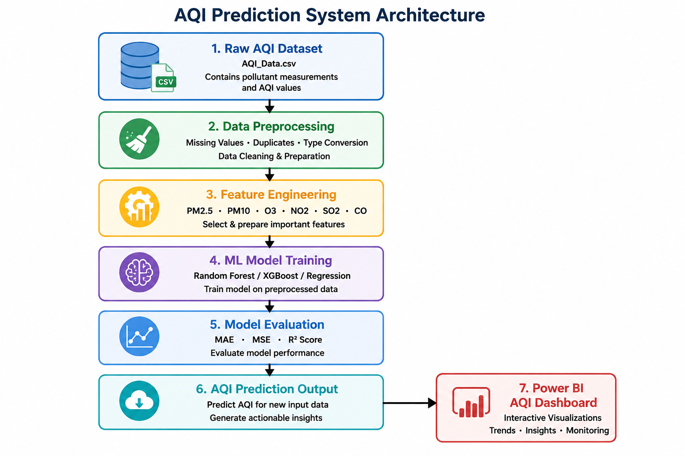
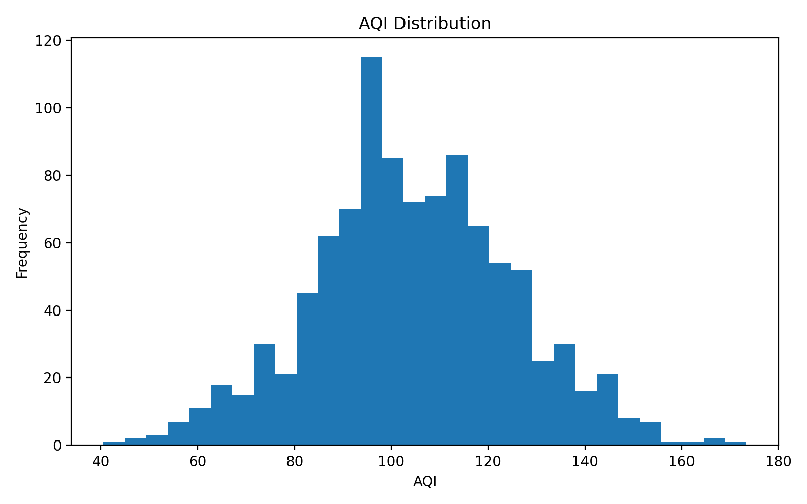
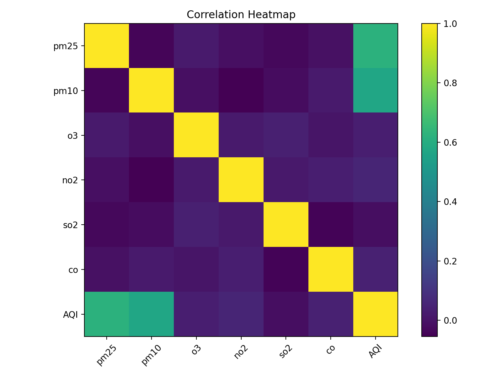
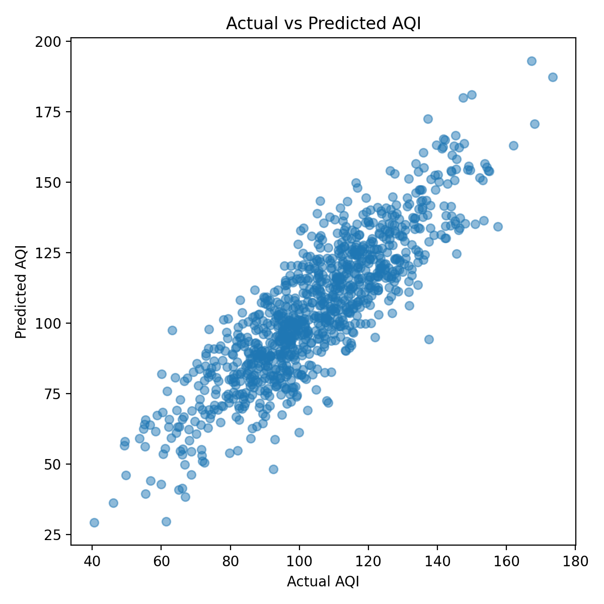
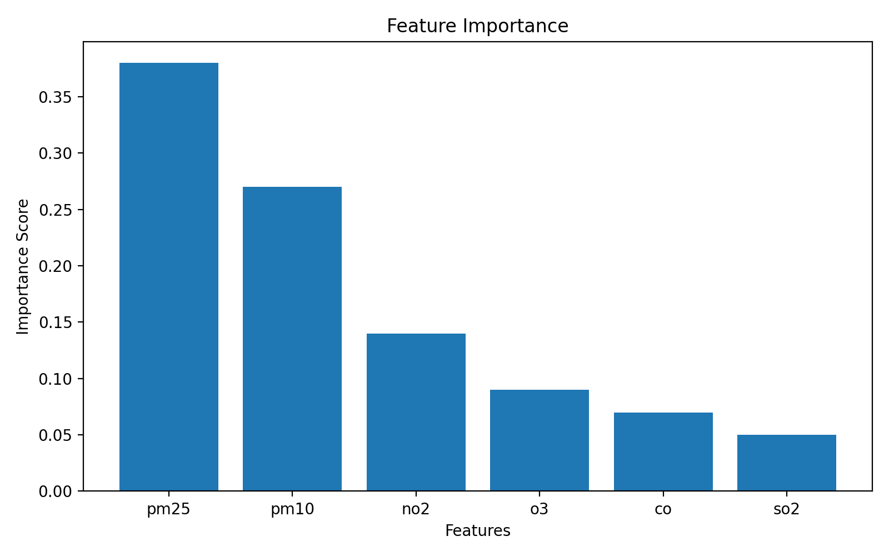

# AQI Prediction Platform

## Overview

This project demonstrates an end-to-end Air Quality Index (AQI) prediction platform using Machine Learning, cloud analytics concepts, and data engineering workflows.

The objective of the project is to predict AQI levels using environmental pollution indicators and build a scalable analytics workflow suitable for modern cloud-based data platforms.

The project combines:
- Data preprocessing
- Machine Learning model development
- Feature engineering
- AQI forecasting
- Analytics reporting
- Cloud-style architecture principles

---

## Project Status

✅ Active Portfolio Project  
✅ Machine Learning Prediction Pipeline  
✅ AQI Forecasting Model  
✅ Analytics Dashboard Reporting  
✅ Cloud-style Architecture  

---

## Architecture Diagram



---

## Architecture

```text
Raw AQI Dataset
        ↓
Data Cleaning & Feature Engineering
        ↓
Machine Learning Model Training
        ↓
AQI Prediction & Forecasting
        ↓
Analytics Dashboard / Reporting
```

---

## Tech Stack

- Python
- Pandas
- NumPy
- Scikit-learn
- XGBoost
- Prophet Forecasting
- Matplotlib
- Power BI
- SQL
- GitHub Actions
- Docker
- Azure-style Analytics Concepts

---

## Key Features

- AQI prediction using supervised learning
- Time series forecasting
- Data cleansing & preprocessing
- Feature engineering
- Model comparison & evaluation
- Environmental analytics reporting
- Cloud-ready project structure
- Automated ML workflow execution
- CI/CD integration
- Docker containerization

---

## Machine Learning Models Used

- Linear Regression
- Decision Tree Regressor
- K-Nearest Neighbour (KNN)
- Support Vector Regression (SVR)
- Random Forest Regressor
- XGBoost Regressor
- Prophet Forecasting

---

## Business Use Case

Air pollution is a major environmental and public health issue affecting urban populations worldwide.

This platform helps:
- Predict AQI levels
- Forecast pollution trends
- Support environmental monitoring
- Enable data-driven policy decisions
- Improve public awareness

Potential use cases:
- Smart city analytics
- Environmental monitoring systems
- Government pollution tracking
- Healthcare impact analysis
- Urban sustainability reporting

---

## Engineering Concepts Demonstrated

- Data preprocessing pipelines
- Machine Learning workflows
- Forecasting techniques
- Feature engineering
- Data analytics reporting
- Cloud analytics architecture
- Predictive modelling
- End-to-end ML lifecycle
- CI/CD automation
- Dockerized ML pipelines

---

## Model Performance Visuals

### AQI Distribution


### Correlation Heatmap


### Actual vs Predicted AQI


### Feature Importance


---

## CI/CD Pipeline

This project includes a GitHub Actions CI/CD workflow that automatically:

- Installs dependencies
- Runs preprocessing pipeline
- Trains AQI prediction model
- Executes prediction validation

Pipeline file:

```text
.github/workflows/ci-cd-pipeline.yml
```

Technologies used:
- GitHub Actions
- Python
- Automated ML workflow execution

---

## Docker Containerization

The AQI ML pipeline is fully containerized using Docker.

### Build Docker Image

```bash
docker build -t aqi-ml-pipeline .
```

### Run Docker Container

```bash
docker run aqi-ml-pipeline
```

### Docker Compose

```bash
docker-compose up
```

Containerized components:
- Data preprocessing
- Model training
- AQI prediction workflow

---

## Production Engineering Features

This repository demonstrates modern production-style engineering practices including:

- Modular Python project structure
- Automated CI/CD pipeline
- Docker containerization
- Machine Learning workflow automation
- Reusable preprocessing pipeline
- Model persistence
- Scalable project architecture
- Analytics-ready reporting structure

---

## How to Run the Project

### Clone Repository

```bash
git clone https://github.com/Kornelius99/AQI_Prediction_KP.git
```

### Install Dependencies

```bash
pip install -r requirements.txt
```

### Train Model

```bash
python src/train_model.py
```

### Run Prediction

```bash
python src/predict.py
```

---

## Future Enhancements

- Deploy model using Azure ML
- Add real-time AQI streaming
- Integrate Apache Kafka
- Add weather API ingestion
- Build interactive Power BI dashboard
- Deploy using Kubernetes
- Add ML monitoring and drift detection
- Integrate Terraform Infrastructure-as-Code

---

## Repository Structure

```text
AQI_Prediction_KP/
│
├── data/
│   └── AQI_Data.csv
│
├── models/
│   └── AQI_Prediction.py
│
├── notebooks/
│   └── AQI_Prediction.ipynb
│
├── src/
│   ├── data_preprocessing.py
│   ├── train_model.py
│   └── predict.py
│
├── visualizations/
│   ├── aqi-architecture.png
│   ├── aqi-distribution.png
│   ├── correlation-heatmap.png
│   ├── actual-vs-predicted.png
│   └── feature-importance.png
│
├── .github/workflows/
│   └── ci-cd-pipeline.yml
│
├── Dockerfile
├── docker-compose.yml
├── requirements.txt
└── README.md
```

---

## Dashboard & Reporting

The project can be extended with:
- AQI trend dashboards
- Pollution heatmaps
- Forecast analytics
- City-wise AQI comparison
- Real-time monitoring

---

## Author

Korneli Pingula  
Senior Data Platform & Analytics Engineer | Azure • AWS • Databricks • PySpark • SQL • Power BI • Machine Learning

LinkedIn:
linkedin.com/in/pingulakornelius

GitHub:
github.com/Kornelius99
